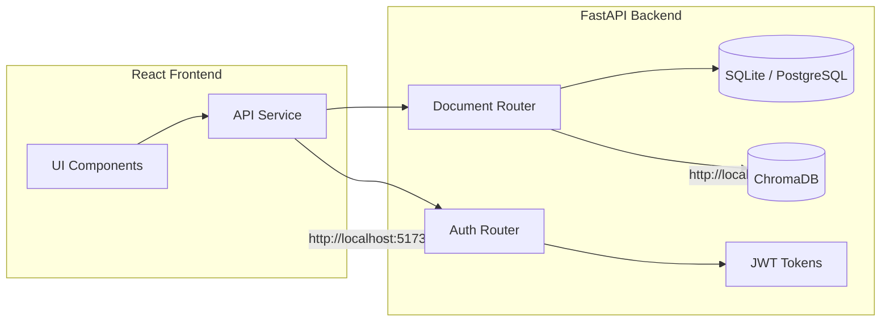
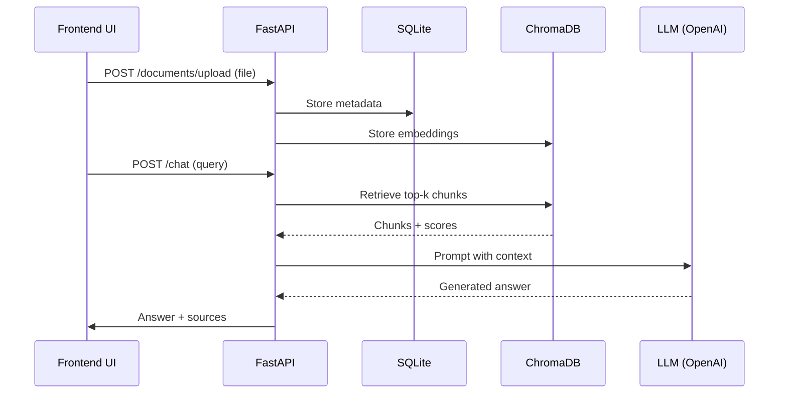

# RAG System

[](LICENSE)
[](https://www.docker.com/)
[](https://www.python.org/)
[](https://fastapi.tiangolo.com/)
[](https://reactjs.org/)

## 📖 Project Overview

A **world‑class Retrieval‑Augmented Generation (RAG)** platform that lets you upload documents of many formats, creates embeddings with a sentence‑transformer, stores them in **ChromaDB**, and serves answers through a **FastAPI** backend and a **React** frontend. The system is containerised with Docker and can be run locally or in production with a single `docker compose up --build` command.

---

## ✨ Key Features

- 📂 Multi‑format document support: PDF, DOCX, PPTX, XLSX, CSV, TXT, Markdown, HTML, JSON, OCR images
- 🤖 Conversational memory with session‑based chat
- 🔐 JWT authentication (register / login)
- 📊 Vector search powered by **ChromaDB**
- 🧩 LangChain & LangGraph workflow orchestration
- 🐳 Dockerised deployment (backend, frontend, ChromaDB)
- ⚙️ Configurable via `.env` (example provided)
- 🧪 Comprehensive test suite (pytest & frontend tests)

---

## 🏗️ Architecture Overview



---

<!-- ## 📸 Screenshots

> *Add UI screenshots here.*

--- -->

## 🛠️ Tech Stack

| Layer | Technology |
|-------|------------|
| **Backend** | FastAPI, SQLAlchemy, LangChain, LangGraph, ChromaDB, Sentence‑Transformers |
| **Frontend** | React, Vite, JavaScript/JSX |
| **Database** | SQLite (default) / PostgreSQL |
| **Vector DB** | ChromaDB |
| **Containerisation** | Docker, Docker‑Compose |

---

## 📂 Project Structure

```
RAG System
├─ backend
│  ├─ Dockerfile
│  ├─ requirements.txt
│  └─ app
│     ├─ __init__.py
│     ├─ main.py
│     ├─ api
│     │   └─ endpoints.py
│     ├─ core
│     │   ├─ config.py
│     │   └─ logging.py
│     ├─ database
│     │   └─ session.py
│     ├─ models
│     │   └─ database.py
│     ├─ services
│     │   ├─ document_processor.py
│     │   ├─ embedding.py
│     │   ├─ rag.py
│     │   ├─ retrieval.py
│     │   └─ vector_store.py
│     └─ utils
├─ frontend
│  ├─ Dockerfile
│  ├─ package.json
│  ├─ vite.config.js
│  └─ src
│     ├─ App.jsx
│     ├─ index.css
│     ├─ main.jsx
│     ├─ components
│     │   ├─ ChatInterface.jsx
│     │   ├─ DocumentSidebar.jsx
│     │   └─ FileUpload.jsx
│     ├─ pages
│     │   └─ Home.jsx
│     └─ services
│         └─ api.js
├─ docker-compose.yml
└─ .env.example
```

---

## ⚙️ Installation

### Prerequisites
- Docker & Docker‑Compose
- Python 3.10+ (for local dev)
- Node.js 18+ (for frontend dev)

### Local Setup
```bash
# Clone repo
git clone https://github.com/YerraRahul23/RAG System.git
cd RAG System

# Backend
python -m venv venv
source venv/bin/activate
pip install -r backend/requirements.txt
cp .env.example .env   # edit as needed
uvicorn backend/app/main:app --reload

# Frontend
cd frontend
npm install
npm run dev   # Vite dev server at http://localhost:5173
```

### Docker Setup
```bash
docker compose up --build   # starts chromadb, backend, frontend
```

---

## 🔐 Environment Variables

```
PROJECT_NAME=RAG System
API_V1_STR=
DATABASE_URL=sqlite:///./rag.db
CHROMA_HOST=chromadb
CHROMA_PORT=8000
CHROMA_COLLECTION=rag_documents
OPENAI_API_KEY=your-openai-key
OPENAI_BASE_URL=https://api.openai.com/v1
OPENAI_MODEL=gpt-4o-mini
```

---

## ▶️ Running the Application

```bash
docker compose up --build
```

---

## 📚 API Documentation

| Method | Endpoint | Description |
|--------|----------|-------------|
| `POST` | `/auth/register` | Register a new user |
| `POST` | `/auth/login` | Login and receive JWT |
| `POST` | `/documents/upload` | Upload a document |
| `POST` | `/chat` | Query the RAG system |
| `GET` | `/health` | System health check |

---

## 🔄 RAG Workflow



---

## 🐳 Docker Deployment

```bash
docker compose up -d   # detach mode
# To stop
docker compose down
```

---

## 🛠️ Development

- **Backend only:** `uvicorn backend/app/main:app --reload`
- **Frontend only:** `npm run dev` inside `frontend`

---

## ✅ Testing

```bash
# Backend tests
pytest backend/tests

# Frontend tests
npm run test --prefix frontend
```

---

## 🚀 Performance Notes

- Embedding model: `all‑MiniLM‑L6‑v2`
- Chunking: ~500‑token chunks
- Vector retrieval: Top‑k via ChromaDB HNSW

---

## 🔒 Security

- JWT authentication with password hashing
- Input validation via Pydantic
- CORS configured (dev open, tighten for prod)

---

## 🗺️ Roadmap

- Streaming responses
- Multi‑user workspaces
- Hybrid search
- Re‑ranking
- Cloud deployment
- Monitoring

<!-- ---

## 📄 License

MIT License – see `LICENSE` file. -->

---

## 🙋‍♂️ Author

**Rahul Yerra** – [GitHub](https://github.com/YerraRahul23)

---

*This README was generated automatically to provide a polished, recruiter‑friendly overview of the RAG System project.*FF